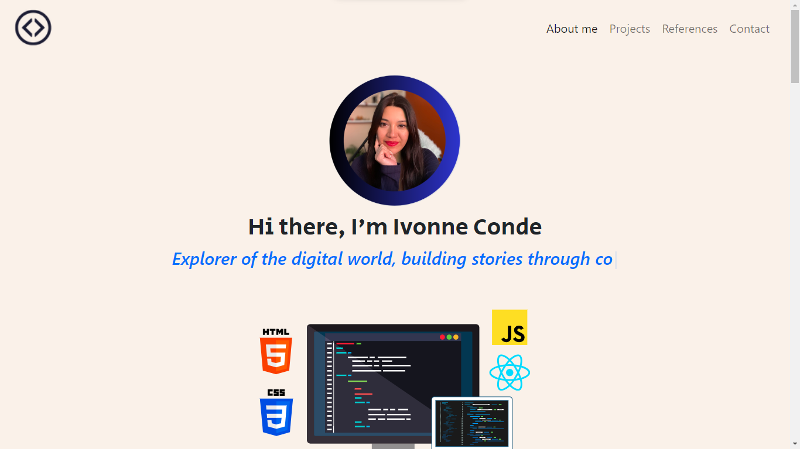
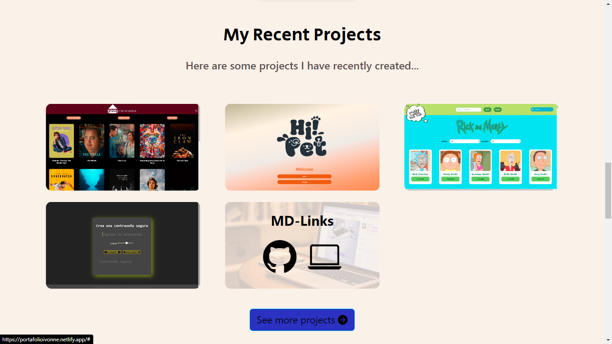

# Ivonne Conde's Portfolio

Welcome to my portfolio! Here you'll find a collection of my projects and works related to web development. If you have any inquiries or would like to collaborate, don't hesitate to contact me.

As a web developer, I specialize in HTML, CSS, JavaScript, React, TypeScript, and more. My main focus is on crafting solutions that enrich user experiences through the power of technology.

## Contents

- [**Featured Projects**](https://portafolioivonne.netlify.app/#proyectos): Here you'll find a selection of my standout projects.
- [**Visit my portfolio online**](https://portafolioivonne.netlify.app/)
- [**GitHub**](https://github.com/IvonneConde)
- [**LinkedIn**](https://www.linkedin.com/in/ivonne-conde/)

  
  

## Technologies

This website was created with:

- HTML
- CSS
- JavaScript 
- Bootstrap 5

In addition, **Google Fonts** were included to customize the font and **Bootstrap icons** were incorporated to add icons such as arrows and logos of popular social media networks. 

## Language

The custom classes and attributes are written in Spanish. Bootstrap-related classes are included in English.

## Usage Instructions

Feel free to explore my portfolio! You can navigate through different projects. If you have any questions or comments, I'll be happy to hear from you.

## Contact

- Email: ivonneconde91@gmail.com
- LinkedIn: [Ivonne Conde](https://www.linkedin.com/in/ivonne-conde/)
- Twitter: [IvOnTheCode](https://twitter.com/IvOnTheCode)

## Contributions

Contributions are welcome! If you find any issues or have suggestions for improvement, feel free to open an issue or submit a pull request.

## Acknowledgements

I'd like to thank [Laboratoria](https://github.com/Laboratoria) for their guidance and teachings throughout the program.

